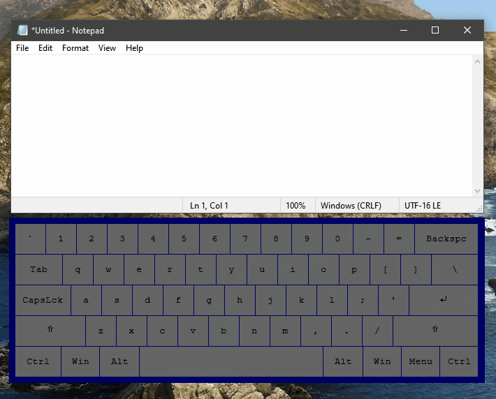
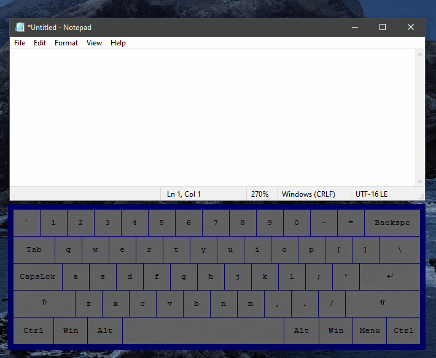

# Windows Accent Layers

<p align="center">
  
</p>

Windows Accent Layers enables macOS-style input of diacritics/accented characters and other special symbols on Windows, without the need for swapping your current keyboard layout. You can also easily customize or create new layouts with simple, single-line definitions.

With [prefix layers](#prefix), an alternative typing method not available in either Windows or macOS by default, you can achieve maximum typing speed in multiple languages while not having to switch out of the US layout at all, and without having to press Alt keys. It works similarly to the US-International layout on Windows, but with the advantage of being completely customizable and not blocking input when modifiers are pressed.

For the fastest multilingual typing experience possible with a minimal amount of keypresses, setting up a prefix-based layout with [prefix timeouts](#ptimeout) is recommended.

<p align="center">
  
</p>

# Accent Layers
This tool is based on the concept of using a hotkey to activate a layer, then inputting a single character to generate an accented or special character. This is one of the methods for quickly typing such characters on macOS (see [[1]](https://support.apple.com/en-is/guide/mac-help/mh27474/mac)[[2]](https://www.reed.edu/it/help/diacritics.html) for more information).

For instance, to produce `é` on macOS, you would press `Option+e`, followed by `e`. To achieve the same with windows-accent-layers, you would press `Alt+e`, followed by `e`. Such definitions are completely customizable and easy to edit. A layer for acute accents (with `Alt+e` activation) can be defined as follows:
```
LAYER !e => aá eé ií oó uú AÁ EÉ IÍ OÓ UÚ
```

With `LAYER` definitions, typing a character after activating a layer will replace it by the character directly to its right. For example, `a` would be replaced by `á` in this layer. This operation is always case-sensitive. Space characters are always ignored.

# Keymaps
They keymap definition syntax is:
```
; Comment
COMMAND HOTKEY => DATA
```

## Commands
The available commands are:

### LAYER
Creates a `LAYER` with its activation set to `HOTKEY`. If a character present in `DATA` is typed before a timeout, it will be replaced by the character directly to its right. Example:

```
; macOS Umlaut/trema layer
LAYER !u => aä eë iï oö uü AÄ EË IÏ OÖ UÜ
```
Typing a character not present in the currently active layer deactivates the layer.

There are two sub-commands for layers:

#### TIMEOUT
After a layer is activated, sends a character after a timer runs out (the default timeout is `0.8s`, and can be turned off). This command is optional. Example:

```
; Sets a TIMEOUT command for layer !u (sends ¨ after timeout)
TIMEOUT !u => ¨
```

#### SPACE
Since spaces are always ignored, you can use the `SPACE` command to set a character to be sent when pressing the space key after activating a layer. This command is optional. Example:

```
; Sends a bullet point character for layer !u when pressing space
SPACE !u => •
```

### MAP
Creates a normal hotkey without layers. You can send a single character or a string of any length. Examples:
```
; Maps Alt+S to ß
MAP !s => ß

; Maps Alt+Shift+/ to ¿
MAP !+/ => ¿

; Maps RightAlt+c to ç
MAP >!c => ç
```

### PREFIX
<a name="prefix"></a>
This command effectively works like modifiers in the US-International layout on Windows, but the advantage of immediately sending the prefix key.

For instance, typing `'` with US-International would lock input until the next character is sent. However, if you wanted to simply type `'` into a text document, you would then have to input `Space`, which is highly undesirable in many situations. This is specially useful if you use any application that requires the modifier keys to be immediately sent to preserve normal functionality (e.g. vim).

Example definition for an acute prefix layer with trigger/prefix `'`:

```
PREFIX ' => aá eé ií oó uú AÁ EÉ IÍ OÓ UÚ
```

You can then type `'a` to produce `á`, or `'e` to produce `é`, and so forth.

Notes:
- For prefix definitions, prefer using single character prefixes instead of Shift combinations (for example, use `{` instead of `+[`, even though they technically mean the same thing if using the US layout).
- This is implemented using [hotstrings](https://www.autohotkey.com/docs/v1/Hotstrings.htm), which means that a backspace is sent to delete the prefix character.
- Since a backspace is sent, keep in mind that this can lead to unexpected behaviors in some applications. As an example, if you were inside a directory in Windows Explorer and typed `[a` while not editing text, a backspace character would be sent, placing you in the previous directory.
- Despite its drawbacks, the `PREFIX` command can lead to the fastest typing speed for some languages, without the need for swapping layouts, and is the recommended input mode for maximum speed. If you are not comfortable with auto replacements and backspacing, stick with layers and maps.

Here is a demonstration of how this looks like in practice (using a clone of the US-International layout, `us-international-prefix.txt`):

<p align="center">
  
</p>

Inside a text editor, the result is visually similar to using `Option` layers in macOS, but with less keypresses.

You can also get creative with prefixes:

```
PREFIX $ => e€ p£
```

In this case, typing `$e` would produce `€`, and `$p` would produce `£`. Another example with dashes:

```
PREFIX - => _– -— =―
```

In this case, typing `-_` would produce `–` (en-dash), typing `--` would produce `—` (em-dash), and typing `-=` would produce `―` (horizontal bar).

### Prefix confirmation/cancellation modes
<a name="ptimeout"></a>
Prefix substitutions are automatically cancelled if there is not a corresponding prefix layer definition for the next character that is typed. However, if the character is defined within the layer, there are 4 different ways to set cancellation behavior, listed below:

- `0`: Don't cancel — This will replace prefixes even if you press Space many times and go back to the same position with Backspace.
- `1`: Cancel on Space — This will cancel the last prefix whenever you press Space. For instance, if you wanted to type the string `'a'` (with quotes) while having a prefix acute layer active (which would replace `'a` with `á`), you could type `'`, then `Space`, then `Backspace`, then a.
- `2`: Space to confirm prefix character — To accomplish the same thing as in the previous example, you could type `'`, then `Space`, then `a`.
- `3`: Double prefix to confirm prefix (default, **recommended**) — Press the prefix twice to confirm the prefix (you would press `""` in the example above). You don't need to press the prefix twice if the next character typed is not present in the layer (in the demo above, you can notice that `"quotes"` is typed without any Space input, while `"input"` required `"` to be pressed twice). If a double prefix is present in the prefix layer definition (e.g. double dash for em-dash), the definition within the layer has higher priority. Considering the em-dash example, it would send an em-dash instead of confirming the prefix. This is the most intuitive option and is the recommended option for new users.
- `4`: Prefix timeouts (**recommended**) — The prefix will timeout after `PREFIX_TIMEOUT` seconds (default: 0.3s). Using this option is highly recommended for fast typing with no additional keypresses, but will require some fine-tuning for your typing speed and is therefore not enabled by default. If a double prefix is present in the prefix layer definition (e.g. double dash for em-dash), the prefix will not timeout and is only cancellable with Space.

Although you may use the above documentation for reference, keep in mind that the easiest way to understand prefix cancellation behavior is trying to use one of the options for your daily typing and see what fits your needs.

### PREFIXMAP
This command simply registers a normal hotstring, the same way MAP registers a normal hotkey. If a prefix is typed, the entire string in DATA will be sent. 

This command should probably be avoided in most cases and is only available for completion and dealing with edge-cases for some languages. Prefixes registered with this command are only cancellable with Space (if and only if `PREFIX_CANCEL_MODE` is set to higher than `0`). If your keymap has a normal PREFIX layer that would conflict with your PREFIXMAP, declare the PREFIXMAP command before any PREFIX layer definitions. Examples:

```
; Simulate physical key position/behavior for portuguese layouts when typing 'çã'
; (3 keypresses are needed, instead of 4)
PREFIXMAP ;'a => çã

; Registers Apple users' most beloved autocompletion
PREFIXMAP omw => On my way!
```

## Hotkeys

This application uses AutoHotkey's [syntax](https://www.autohotkey.com/docs/v1/Hotkeys.htm#Symbols) for defining hotkeys. In case you are not familiar with it, here are the most important keys:

- `^` is `Ctrl`
- `#` is `Win`
- `!` is `Alt`
- `+` is `Shift`.
- `<` is a modifier for `left` (for instance, `<^` means `LeftCtrl`)
- `>` is a modifier for `right` (for instance, `>^` means `RightCtrl`)

# Running automatically at startup

If you wish this application to run automatically at startup, press `Windows+R` to open the Run window, type `shell:startup` to open your current user's startup folder and create a shortcut for windows-accent-layers.ahk or windows-accent-layers.exe there. Note: if you are using this application to interact with other applications running with elevated/administrator privileges, this application must run with administrator privileges as well, otherwise inputs will be ignored when such applications are focused.

# Installation and usage
You can either download and execute the script directly with [AutoHotkey v1](https://github.com/AutoHotkey/AutoHotkey/releases/tag/v1.1.37.01), or download and execute the pre-compiled binaries. This code was only tested with AutoHotkey v1.1.37.01, and will not run with AutoHotkey v2.

## As a script
- Download the source code.
- Open **windows-accent-layers.ahk** with [AutoHotkey v1](https://github.com/AutoHotkey/AutoHotkey/releases/tag/v1.1.37.01) (Unicode version).

## Compiled version
- Download and unzip the binaries.
- Open **windows-accent-layers.exe**.

## Usage
- Browse and select a keymap from the `/keymaps` directory, or make your own.
- Set your selected keymap and other options on `options.ini`.
- Activate a layer to type special characters.

# Troubleshooting
In case you encounter any issues with garbage characters after editing keymap definitions, make sure you are saving them with UTF-16 LE encoding. Other character encodings, such as UTF-8, UTF-8 with BOM and UTF-16 BE will most likely produce garbage characters. Make sure you are also using a Unicode version of AutoHotkey.

# Acknowledgements
This project was initially developed as a generalization of Lexikos' original [script](https://autohotkey.com/board/topic/27801-special-characters-osx-style/?p=697602) for typing special characters on Windows, along with its very elegant data format. Icon art is provided by [kumakamu](https://flaticon.com/authors/kumakamu).
